[Home](index.md) / [Data](Data.md) / [Methodology](Methodology.md) / [Results](Results.md) / [Conclusion](Conclusions.md)

# **Results and Visualizations**

This section presents the key results from K-means clustering, Model-Based Clustering, and Inference to better understand the factors influencing tipping behavior and FHV ride patterns.

---

## 1. **K-means Clustering**
- Clustering analysis was conducted separately for two time periods: Rush hour (Morning) and Non-Rush hour (Noon).
- K-means clustering was initialized using hierarchical clustering to determine starting cluster centers.

### **a. Rush Hour (Morning) K-means Clusters**:
The plot below visualizes the K-means clustering (k = 3) results for the morning data, projected onto the first two principal components (PC1 and PC2). The clusters (1, 2, and 3) are color-coded as red, green, and blue, respectively.

- **K-means Plot**:

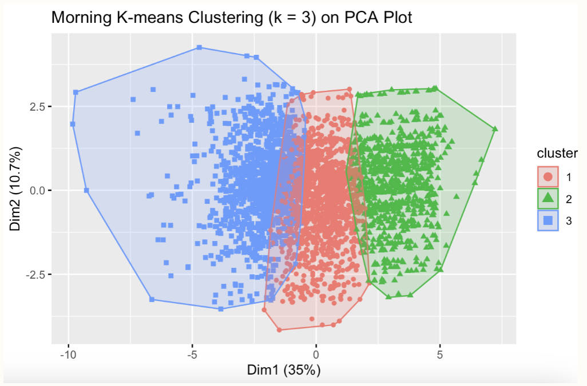

- **Interpretation**:
  - **Cluster 3 (blue)** is positioned on the **negative side of PC1**, representing trips with higher trip characteristics (e.g., longer trips, higher charges, and more tolls).
  - **Cluster 2 (green)** is positioned on the **positive side of PC1**, indicating trips with lower trip characteristics (e.g., shorter trips, lower charges, and likely fewer tolls).
  - **Cluster 1 (red)** lies in between, capturing trips with moderate trip characteristics.
  - PC1 drives most of the separation, highlighting the importance of trip-related factors, while PC2 contributes less to differentiation, capturing secondary factors like tipping behavior or weather.

- **Morning PC Loadings Plot**:

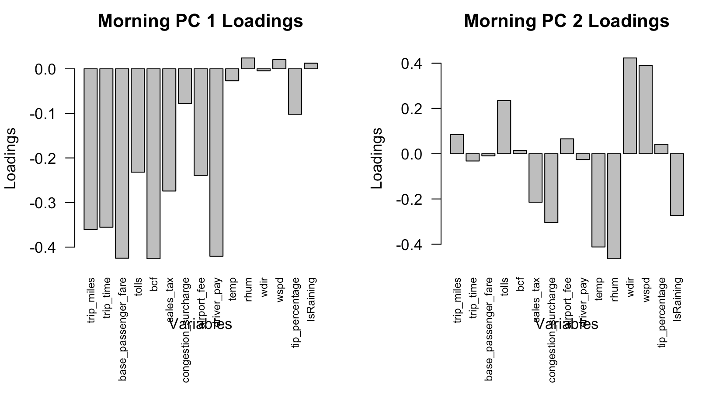

- **Interpretation**:
  - **PC1** explains the largest proportion of variance, with most variables having **negative loadings**. Higher values for these variables are associated with **lower PC1 scores**.
  - Key contributors to PC1 include:
    - **Trip Distance**, **Trip Duration**, **Base Passenger Fare**, **Tolls**, and **Sales Tax**, indicating longer, more expensive trips drive the clustering.
  - These variables strongly influence Cluster 3 (blue), which represents premium trips.

- **Determining Optimal Clusters**:

- **Interpretation**:
  - The **CH index** is highest at **k = 2**, suggesting that two clusters provide the strongest separation.
  - The **elbow plot** also suggests the optimal number of clusters lies between **k = 2 and k = 3**.
  - Based on visualizations and interpretability of the clustering results, **k = 3** was chosen to better differentiate distinct rider behaviors during rush hour.

### **b. Non-Rush Hour (Noon) K-means Clusters**
The plot below visualizes the K-means clustering (k = 2) results for the noon data, projected onto the first two principal components (PC1 and PC2). The clusters (1 and 2) are color-coded as red and blue, respectively.

- **K-means Plot**:

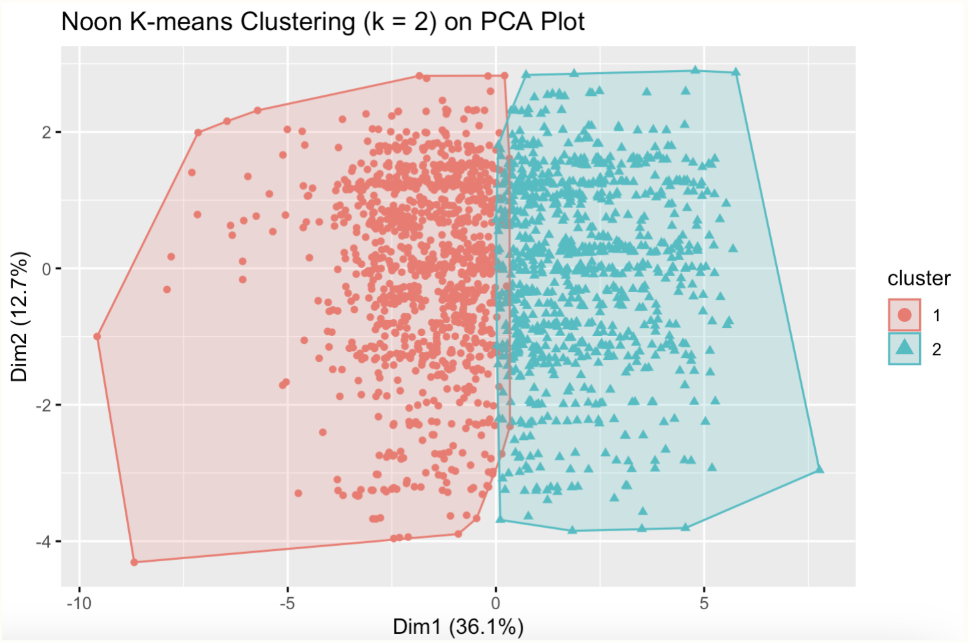

- **Interpretation**:
  - **Cluster 1 (red)** is positioned on the **negative side of PC1**, representing trips with **higher trip characteristics**, such as longer distances and higher costs.
  - **Cluster 2 (blue)** is positioned on the **positive side of PC1**, capturing trips with **lower trip characteristics**, such as shorter distances and lower costs.
  - The separation between clusters is primarily driven by PC1, reflecting differences in trip-related variables.

- **Determining Optimal Clusters**:

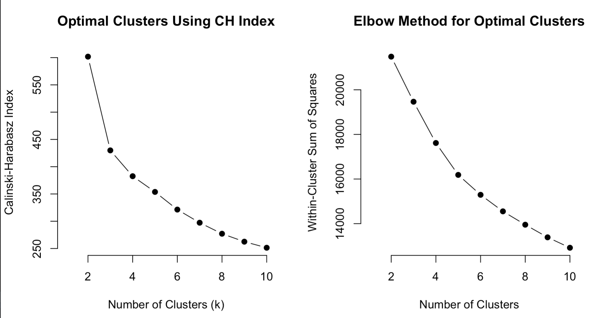

- **Interpretation**:
  - The **CH index** is highest at **k = 2**, confirming that two clusters provide the strongest separation for noon data.
  - The **elbow plot** similarly supports **k = 2** as the optimal number of clusters.
  - The clustering results align well with these findings, so we proceed with **k = 2** clusters for non-rush hour.

---

## 2. **Model-Based Clustering**
The plot below visualizes the Model-Based Clustering (k = 3) results for the morning data, projected onto the first two principal components (PC1 and PC2). The clusters (1, 2, and 3) are color-coded as red, green, and blue, respectively.

### **a. Testing Model-Based Assumptions**

### **b. Rush Hour (Morning) Model-Based Clustering**

- **Morning Model-Based Plot**:
  
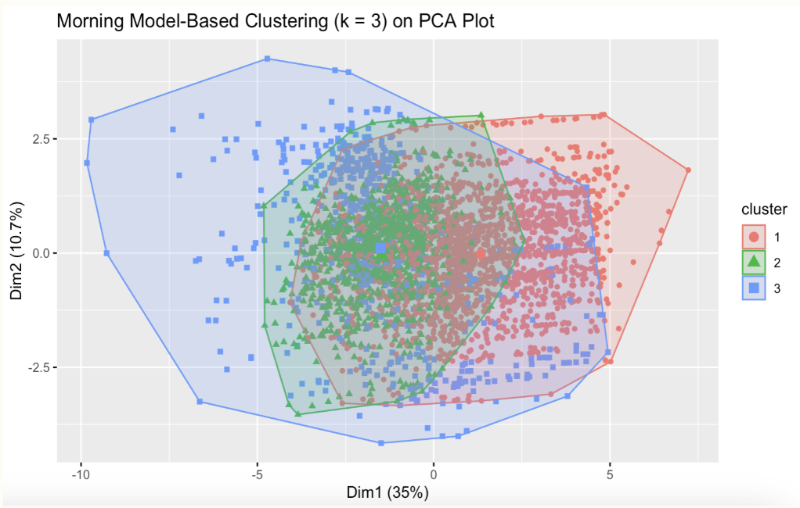

- **Interpretation**:
  - Significant overlap between the clusters, particularly between Clusters 2 and 3, suggests that while the model-based approach identifies group differences, some riders exhibit transitional or shared characteristics.
  - The spread of Cluster 3 is broader, indicating greater variability in trip-related features for this group.
  - Compared to K-means clustering, the separation of clusters is less distinct, particularly along PC2. This reflects the probabilistic nature of model-based clustering, which accounts for uncertainty in assigning data points to clusters.

 - **Determining Optimal Clusters**:

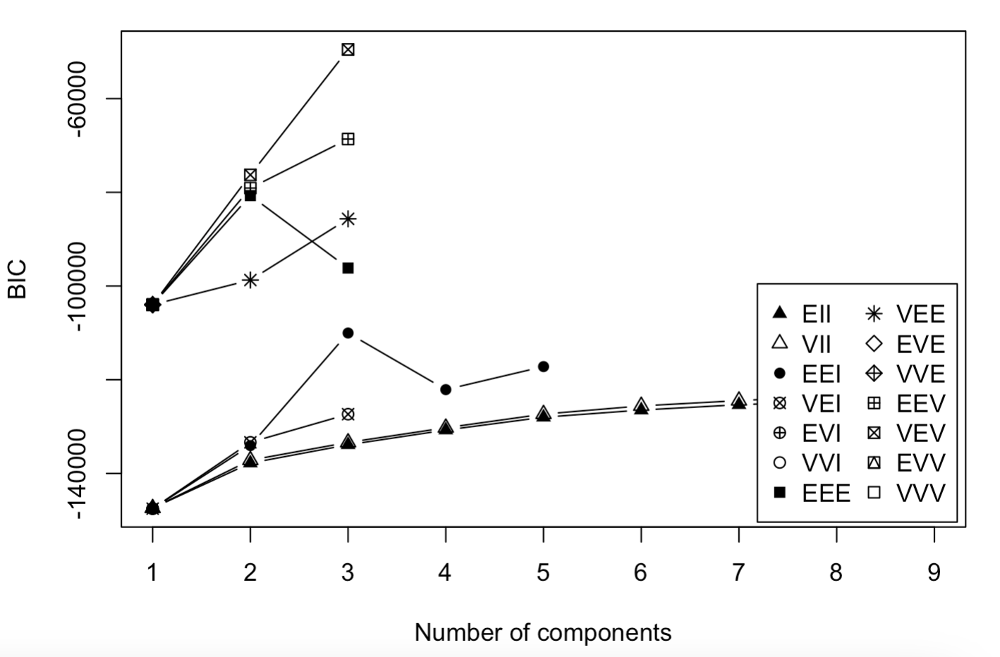

- **Interpretation**:
  - From the BIC plot above, it shows that the most optimal model is Mclust VEV (ellipsoidal, equal shape) model with 3 clusters. 

  
### **c. Non-Rush Hour (Noon) Model-Based Plots**
The plot below visualizes the Model-Based Clustering (k = 6) results for the morning data, projected onto the first two principal components (PC1 and PC2). The clusters are are color-coded below:

- **Noon Model-Based Plot**:
  

- **Interpretation**:
  - Significant overlap is observed, especially among Clusters 1, 4, and 5, suggesting some shared characteristics between these clusters.
  - Clusters 3 and 6 have more distinct boundaries, likely reflecting trips with extreme values for trip distance or cost.
  - Again, clusters are primarily separated along PC1, indicating that trip-related variables (e.g., trip distance, fare, and tolls) are the dominant factors in clustering.
  - Compared to K-means clustering, the separation of clusters is much less distinct.

 - **Determining Optimal Clusters**:

   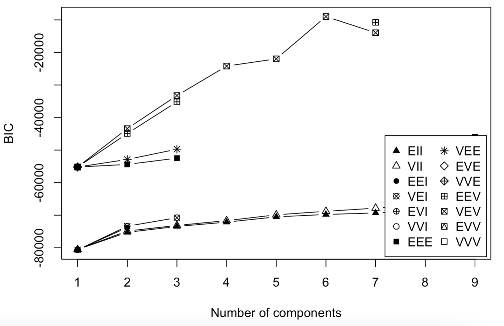

- **Interpretation**:
  - From the BIC plot above, it shows that the most optimal model is Mclust VEV (ellipsoidal, equal shape) model with 6 clusters.

 
### **d. Comparing K-means vs Model Based Clustering Methods**
- We aim to compare the K-means and Model-Based clusters to determine which method is more suitable for inference.
- To make this comparison, we assess the clusters based on their ability to minimize the total within-cluster variation and maximize the total between-cluster variation.
- The diagram below indicate that K-means clustering is the most optimal approach for both rush hour (blue) and non-rush hour (red), as it minimizes the total within-cluster variation while maximizing the total between-cluster variation.

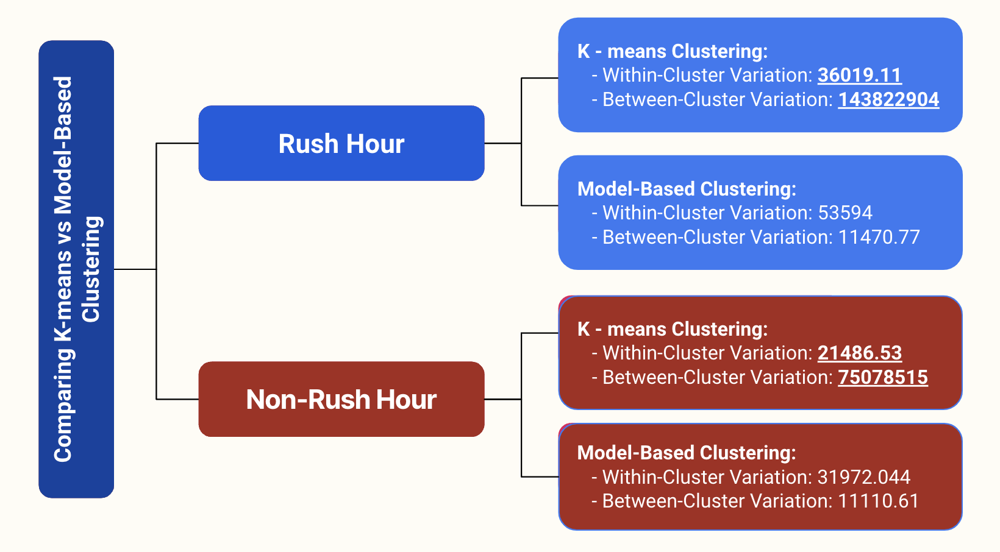

---

## 3. **Inference**
- The clustering results were analyzed using inference to gain insights into rider behavior, tipping habits, trip characteristics, and the influence of external factors such as weather and time of day.

### **a. Rush Hour Inference**

#### **MANOVA Inference**
- The MANOVA test was conducted to examine differences across rush hour clusters for the following variables:
  - **IsRaining**, **Tip Percentage**, **Trip Miles**, **Trip Time**, **Temperature**, **IsRaining** ,and **Black Car Fee**.
  - These specific variables were chosen to determine whether trip characteristics and weather variables vary across clusters. Additionally, since only the first principal component had a distinct loading while other components contributed minimally, we excluded principal components from this analysis.
- The test yielded a p-value of **<2.2e-16**, which is much smaller than the 5% significance level. Thus, we reject the null hypothesis, indicating that these variables differ significantly across the clusters.
- To further investigate, one-way inference was conducted to identify which variables significantly differ across clusters.

#### **One-way Inference**
- **ANOVA** was conducted to determine the significant variables across clusters. For rush hour, all six variables were found to be significant, with the top 4 most significant variables listed below:
  - **Significant Variables**:
    - **Tip Percentage**
    - **Trip Miles**
    - **Trip Duration**
    - **Black Car Fee**

#### **Cluster-Specific Observations**

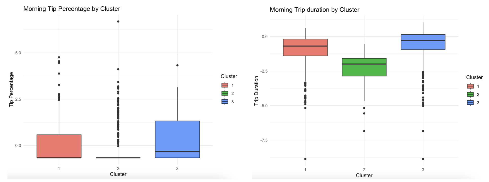

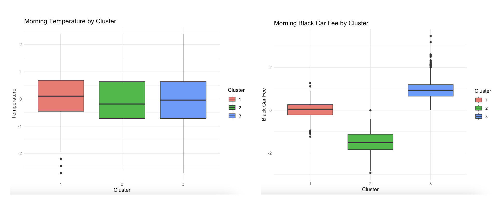

- **Cluster 3 (Blue)**:
  - Most likely represents premium trips with the **highest tip percentages**, **longest trip durations**, and highest black car fees. Trips in this cluster are more frequent during **warmer conditions**.

- **Cluster 2 (Green)**:
  - Represents budget friendly trips with the **lowest tip percentages**, **shortest trip durations**, and lowest black car fees. Trips are more common in **colder conditions** and often involve no additional fees.

- **Cluster 1 (Red)**:
  - Represents average trips with low/moderate tip percentages**, trip durations, and bcf/extra fees. Weather conditions for these trips are average, falling between the extremes of Clusters 2 and 3.

### **Bonferroni Pairwise Comparisons**

Bonferroni-corrected pairwise comparisons were conducted for rush hour clusters to validate insights from the boxplots and identify significant differences across key variables. Below are the findings:

- **Temperature**:
  - Significant differences were observed in mean temperature across clusters. Cluster 2 had the lowest mean temperature, suggesting that trips in this cluster are more common during colder conditions. In contrast, Clusters 1 and 3 exhibited similar mean temperatures, indicating that temperature differences are primarily driven by the distinction between Cluster 2 and the other clusters.

- **Tip Percentage**:
  - Tip percentage showed notable differences between all clusters. Cluster 3 had the highest mean tip percentage, reflecting generous tipping behavior often associated with longer, premium trips. Meanwhile, Cluster 1 exhibited minimal tipping behavior, corresponding to shorter, regular trips without additional fees. Cluster 2 fell between these two extremes, with generally low tipping behavior.

- **Trip Distance and Duration**:
  - Trip distance and duration followed a clear pattern. Cluster 3 represented the longest trips, significantly longer than both Cluster 1 and Cluster 2, aligning with its association with premium services. Cluster 2 had the shortest trips, highlighting its focus on cost-efficient, short-distance travel. Cluster 1 featured moderate trip distances and durations, reflecting a mix of travel patterns.

- **Black Car Fee**:
  - Black Car Fees differed significantly across clusters. Cluster 3 had the highest mean Black Car Fee, indicative of premium services or additional charges. Cluster 2, in contrast, showed the lowest mean Black Car Fee, characteristic of budget-conscious trips. Cluster 1 fell in the middle, with moderate fees representing a blend of regular and premium trips.

- **Rain (Is Raining)**:
  - Rainy conditions played a role in clustering. Cluster 1 had the highest proportion of trips during rain, indicating it is most associated with weather-affected riders. Cluster 3 had the lowest proportion of trips during rain, suggesting that these trips are less influenced by inclement weather. Cluster 2 fell between the other clusters, with a lower proportion of trips during rain than Cluster 1 but not significantly different from Cluster 3.

### **b. Non-Rush Hour Inference**

#### **MANOVA Inference**
- The MANOVA test was conducted to examine differences across the non-rush hour clusters for the following variables:
  - **IsRaining**, **Tip Percentage**, **Trip Miles**, **Trip Time**, **Temperature**, **IsRaining** ,and **Black Car Fee**.
  - Again,these specific variables were chosen to determine whether trip characteristics and weather variables vary across clusters. 
- The test yielded a p-value of **<2.2e-16**, which is much smaller than the 5% significance level. Thus, we reject the null hypothesis, indicating that these variables differ significantly across the clusters.
- To further investigate, one-way inference was conducted to identify which variables significantly differ across the two clusters.

#### **One-way Inference**
- **ANOVA** was conducted to determine the significant variables across the two clusters. For non-rush hour, **only four variables** were found to be significant, which are listed below:
  - **Tip Percentage**
  - **Trip Miles**
  - **Trip Duration**
  - **Black Car Fee**

#### **Cluster-Specific Observations**

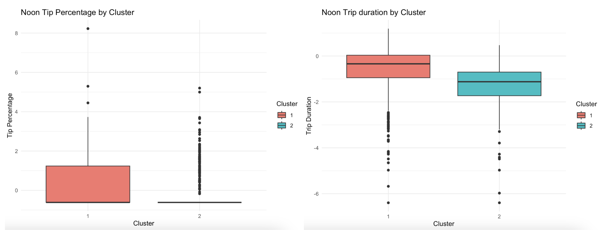

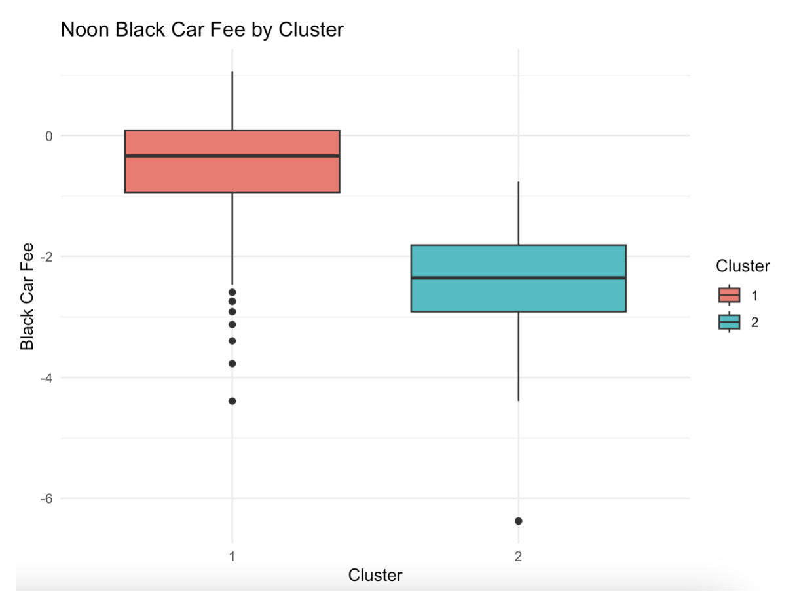

- **Cluster 1 (Red)**:
  - Characterized by **premium trips**, with the **highest tip percentages**, **longest trip durations**, and **highest black car fees**. These trips likely represent high-value, long-distance rides.
  - Weather variables did not significantly differentiate this cluster from Cluster 2.

- **Cluster 2 (Blue)**:
  - Represents **low-cost trips**, featuring **lower tip percentages**, **shorter trip durations**, and **minimal black car fees**. These trips align with budget-friendly, short-distance travel patterns.

### **Bonferroni Correction ANOVA**

Bonferroni-corrected pairwise comparisons were conducted to validate the observed differences and ensure the robustness of the results. The findings for the significant variables are as follows:

- **Tip Percentage**:
  - Tip percentage was significantly higher in **Cluster 1**, reflecting more generous tipping behavior typically associated with premium services.
  - **Cluster 2** showed minimal tipping behavior, consistent with shorter and more economical trips.

- **Trip Distance and Duration**:
  - **Cluster 1** trips were significantly longer in both distance and duration, highlighting its association with high-value, premium travel.
  - **Cluster 2** had much shorter trips, explaining its lower tipping behavior and reduced service costs.

- **Black Car Fee**:
  - **Cluster 1** had significantly higher black car fees, indicative of additional services or charges associated with premium rides.
  - **Cluster 2** showed minimal black car fees, reinforcing its identification as a cost-effective, basic service cluster.

- **Weather Variables (Temperature and IsRaining)**:
  - Neither **Temperature** nor **IsRaining** exhibited statistically significant differences between the clusters.
  - These results suggest that weather conditions did not play a major role in differentiating rider behavior or trip characteristics during non-rush hours.

---

[Back](Methodology.md)     [Next](Conclusions.md)       
