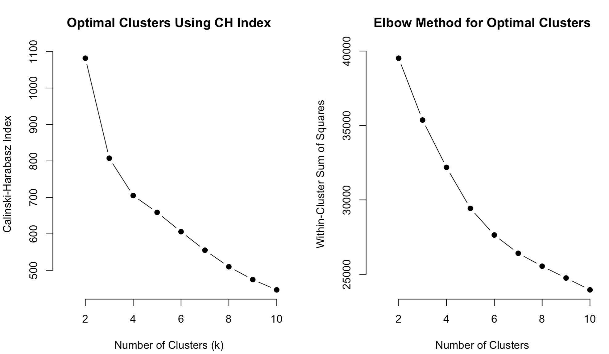

# Results and Visualizations

This section presents the key results from K-means clustering, Model-Based Clustering, and Inference to better understand the factors influencing tipping behavior and FHV ride patterns.

---

## 1. **K-means Clustering**
- Clustering analysis was conducted separately for two time periods: Rush hour (Morning) and Non-Rush hour (Noon).
- K-means clustering was initialized using hierarchical clustering to determine starting cluster centers.

---

### a. **Rush Hour (Morning) K-means Clusters**:
The plot below visualizes the K-means clustering (k = 3) results for the morning data, projected onto the first two principal components (PC1 and PC2). The clusters (1, 2, and 3) are color-coded as red, green, and blue, respectively.

- **K-means Plot**:

- **Interpretation**:
  - **Cluster 3 (blue)** is positioned on the **negative side of PC1**, representing trips with higher trip characteristics (e.g., longer trips, higher charges, and more tolls).
  - **Cluster 2 (green)** is positioned on the **positive side of PC1**, indicating trips with lower trip characteristics (e.g., shorter trips, lower charges, and likely fewer tolls).
  - **Cluster 1 (red)** lies in between, capturing trips with moderate trip characteristics.
  - PC1 drives most of the separation, highlighting the importance of trip-related factors, while PC2 contributes less to differentiation, capturing secondary factors like tipping behavior or weather.

---

- **Morning PC Loadings Plot**:

- **Interpretation**:
  - **PC1** explains the largest proportion of variance, with most variables having **negative loadings**. Higher values for these variables are associated with **lower PC1 scores**.
  - Key contributors to PC1 include:
    - **Trip Distance**, **Trip Duration**, **Base Passenger Fare**, **Tolls**, and **Sales Tax**, indicating longer, more expensive trips drive the clustering.
  - These variables strongly influence Cluster 3 (blue), which represents premium trips.

---

- **Determining Optimal Clusters**:

- **Interpretation**:
  - The **CH index** is highest at **k = 2**, suggesting that two clusters provide the strongest separation.
  - The **elbow plot** also suggests the optimal number of clusters lies between **k = 2 and k = 3**.
  - Based on visualizations and interpretability of the clustering results, **k = 3** was chosen to better differentiate distinct rider behaviors during rush hour.

---

### b. **Non-Rush Hour (Noon) K-means Clusters**
The plot below visualizes the K-means clustering (k = 2) results for the noon data, projected onto the first two principal components (PC1 and PC2). The clusters (1 and 2) are color-coded as red and blue, respectively.

- **K-means Plot**:

- **Interpretation**:
  - **Cluster 1 (red)** is positioned on the **negative side of PC1**, representing trips with **higher trip characteristics**, such as longer distances and higher costs.
  - **Cluster 2 (blue)** is positioned on the **positive side of PC1**, capturing trips with **lower trip characteristics**, such as shorter distances and lower costs.
  - The separation between clusters is primarily driven by PC1, reflecting differences in trip-related variables.

---

- **Determining Optimal Clusters**:

- **Interpretation**:
  - The **CH index** is highest at **k = 2**, confirming that two clusters provide the strongest separation for noon data.
  - The **elbow plot** similarly supports **k = 2** as the optimal number of clusters.
  - The clustering results align well with these findings, so we proceed with **k = 2** clusters for non-rush hour.

---

## 2. **Model-Based Clustering**
The plot below visualizes the Model-Based Clustering (k = 3) results for the morning data, projected onto the first two principal components (PC1 and PC2). The clusters (1, 2, and 3) are color-coded as red, green, and blue, respectively.

### a. **Testing Model-Based Assumptions**

### b. **Rush Hour (Morning) Model-Based Clustering**

- **Morning Model-Based Plot**:
  

- **Interpretation**:
  - Significant overlap between the clusters, particularly between Clusters 2 and 3, suggests that while the model-based approach identifies group differences, some riders exhibit transitional or shared characteristics.
  - The spread of Cluster 3 is broader, indicating greater variability in trip-related features for this group.
  - Compared to K-means clustering, the separation of clusters is less distinct, particularly along PC2. This reflects the probabilistic nature of model-based clustering, which accounts for uncertainty in assigning data points to clusters.

 - **Determining Optimal Clusters**:

- **Interpretation**:
  - From the BIC plot above, it shows that the most optimal model is Mclust VEV (ellipsoidal, equal shape) model with 3 clusters. 

  
### c. **Non-Rush Hour (Noon) Model-Based Plots**
The plot below visualizes the Model-Based Clustering (k = 6) results for the morning data, projected onto the first two principal components (PC1 and PC2). The clusters are are color-coded below:

- **Noon Model-Based Plot**:
  

- **Interpretation**:
  - Significant overlap is observed, especially among Clusters 1, 4, and 5, suggesting some shared characteristics between these clusters.
  - Clusters 3 and 6 have more distinct boundaries, likely reflecting trips with extreme values for trip distance or cost.
  - Again, clusters are primarily separated along PC1, indicating that trip-related variables (e.g., trip distance, fare, and tolls) are the dominant factors in clustering.
  - Compared to K-means clustering, the separation of clusters is much less distinct.

 - **Determining Optimal Clusters**:

   

- **Interpretation**:
  - From the BIC plot above, it shows that the most optimal model is Mclust VEV (ellipsoidal, equal shape) model with 6 clusters.

 
### d. **Comparing K-means vs Model Based Clustering Methods**
- We want to compare the K-means Cluster vs Model Based produced clsuters to see which one should be used for inference.
- To do so, we want to find the clusters that minimized the total within-cluster variation and the total between-cluster variation 
- The diagram below shows that k-means cluster seems to be the most optimal for both rush hour and non-rush hour 

---

## 3. **Visualizing Pickup/Dropoff Locations**
- Initially, pickup/dropoff locations were plotted based off of longitute and latitudee as points on google maps, but it was quite hard to discern the patterns.
- Instead, hexbin plots were utilized instead in order to observe the pickup/dropoff count on top of NYC's map to osberve any patterns.

### a. **Pickup Location Observations**

- **Visualization**:

- **Interpretation**:
  - The hexbin pickup maps for morning, noon, and evening clearly show how ride-hailing demand shifts throughout the day.
  - It is unsurprising that the most popular pickup location is around Midtown Manhattan. However, an interesting pattern emerges as the day progresses, with Midtown becoming a less dominant pickup spot.
    - This suggests that while the morning sees a high concentration of pickups in central Manhattan, potentially related to nightlife or early commuters, the assumption that people would be coming from various parts of the city in the morning doesn't hold as strongly.
  - Though less noticeable, residential areas such as Brooklyn show a higher concentration of pickups in the morning compared to other times of the day, indicating shifting demand patterns.

  

### b. **Dropoff Location Observations**

- **Visualization**:

- **Interpretation**:
  - In the morning, drop-offs are predominantly concentrated in lower Manhattan, particularly in the Financial District, which aligns with the morning commute as workers head to offices and other commercial hubs.
  - However, the yellow hexbin in the morning points to the Upper East Side, which is primarily a residential area. This is an intriguing observation, as it suggests that the Upper East Side experiences higher drop-off activity than expected during the morning hours.
  - Much like the pickup map, it appears that the highly concentrated drop-off locations in lower Manhattan and the Upper East side begin to fade or become less significant as the day progresses.
  - This could indicate that taxis as a commuting option are less popular later in the day, possibly giving way to other modes of transport or indicating less concentrated work-related travel after the morning rush.

---
